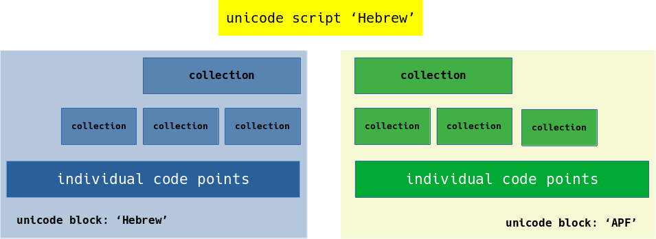

# Introduction

This library contains a number of layered functions.


The first layer contains control of an individual unicode code points as listed in the unicode blocks `Hebrew` and `Alphabetic Presentation Forms` (AFP).


Within each **unicode block** there are a number of collections to be named. These collections consist of related unicode code points.  There are also a number of collections of collections.


Within the **unicode scipt Hebrew**, there are a number of collections, which contain items from both the unicode blocks `Hebrew` and `AFP`.



# Crate layout

The layout of the crate is as follows:

- [unicode_block_hbr.rs](src/unicode_block_hbr.rs)
  
  > Contains all functions for testing individual characters (that are applicable) within the unicode code page: *Hebrew*.

- [unicode_block_apf.rs](src/unicode_block_apf.rs)
  
  > Contains all functions for testing individual characters (that are applicable) within the unicode code page: *Alphabetic Presentation Form*.

- [collections.rs](src/collections.rs)
  
  > Contains all functions related to collections of individual characters or collections of collections.

- [trait_def.rs](src/trait_def.rs)
  
  > Contains the trait definitions for all functions.

- [trait_impl.rs](src/trait_impl.rs)
   
  > Contains the trait implementation for all functions.
 

## Function hiearchy

### Unicode script 'Hebrew' (top level):

``` sh
  - is_script_hbr(c: char) -> bool
  - is_script_hbr_consonant(c: char) -> bool
  - is_script_hbr_point(c: char) -> bool
  - is_script_hbr_ligature_yiddisch(c: char) -> bool
```

### Unicode block: 'Hebrew' 

2nd level:
``` sh
  - is_hbr_consonant(c: char) -> bool
  - is_hbr_accent(c: char) -> bool
  - is_hbr_mark(c: char) -> bool
  - is_hbr_point(c: char) -> bool
  - is_hbr_punctuation(c: char) -> bool
  - is_hbr_yod_triangle(c: char) -> bool
  - is_hbr_ligature_yiddish(c: char) -> bool
```

3rd level: (a collection of unicode code-points)
``` sh
    - is_hbr_consonant_normal(c: char) -> bool
    - is_hbr_consonant_final(c: char) -> bool
    - is_hbr_point_vowel(c) -> bool
    - is_hbr_point_semi_vowel(c) -> bool
    - is_hbr_point_reading_sign(c) -> bool
```

4th level: (unicode code-points)
``` sh
    - is_hbr_consonant_final_kaf(c) -> bool
    - is_hbr_consonant_kaf(c) -> bool
    - is_hbr_point_sheva(c) -> bool
    - is_hbr_accent_revia(c: char) -> bool
    - is_hbr_mark_masora_circle(c: char) -> bool
    - is_hbr_punctuation_sof_pasuq(c: char) -> bool
    - is_hbr_ligature_yiddisch_vav_yod(c: char) -> bool
```
### Unicode block: 'Alphabetic Presentation Forms'

2nd level:  (a collection of unicode code-points)
``` sh
  - is_apf_consonant(c: char) -> bool
  - is_apf_block(c: char) -> bool
  - is_apf_point_reading_sign(c: char) -> bool
  - is_apf_ligature_yiddisch(c: char) -> bool
  - is_apf_ligature(c: char) -> bool
```

3rd level: (a collection of unicode code-points)
``` sh
    - is_apf_consonant_alternative(c: char) -> bool
    - is_apf_consonant_wide(c: char) -> bool
    - is_apf_consonant_with_vowel(c: char) -> bool
```

4th level: (unicode code-points)
``` sh
    - is_apf_consonant_wide_kaf(c) -> bool
    - is_apf_consonant_vowel_he_mapiq(c) -> bool
    - is_apf_consonant_alternative_ayin(c) -> bool
    - is_apf_ligature_alef_lamed(c: char) -> bool
    - is_apf_point_judeo_spanish_varika(c: char) -> bool
```
# Examples

| code point                     | ⊂ | block-set #1         | ⊂ | block-set #2| ⊂ |script - set #1        |
| ------------------------------ | - | ------------------------- | - | -----------------| - | -------------------- |
| hbr_consonant_alef             | ⊂ | hbr_consonant_normal      | ⊂ | hbr_consonant   | ⊂ | script_hbr_consonant |
| hbr_consonant_final_mem        | ⊂ | hbr_consonant_final       | ⊂ | hbr_consonant   | ⊂ | script_hbr_consonant |
| apf_consonant_wide_alef        | ⊂ | apf_consonant_wide        | ⊂ | apf_consonant   | ⊂ | script_hbr_consonant |
| hbr_point_qubuts               | ⊂ | hbr_point_vowel           | ⊂ | hbr_point       | ⊂ | script_hbr_point |
| hbr_point_sheva                | ⊂ | hbr_point_semi_vowel      | ⊂ | hbr_point       | ⊂ | script_hbr_point |
| hbr_point_meteg                | ⊂ | hbr_point_reading_sign    | ⊂ | hbr_point       | ⊂ | script_hbr_point |
| apf_point_judeo_spanish_varika | ⊂ | afp_point_reading_sign    |   |                 | ⊂ | script_hbr_point |
| hbr_point_meteg                | ⊂ | hbr_point_reading_sign    |   |                 | ⊂ | script_hbr_point_reading_sign |
| apf_point_judeo_spanish_varika | ⊂ | afp_point_reading_sign    |   |                 | ⊂ | script_hbr_point_reading_sign |
| hbr_ligature_yiddisch_vav_yod  | ⊂ | is_hbr_ligature_yiddish   |   |                 | ⊂ | script_hbr_ligature |
| apf_ligature_alef_lamed        | ⊂ | is_apf_ligature           |   |                 | ⊂ | script_hbr_ligature |
| hbr_ligature_yiddisch_vav_yod  | ⊂ | is_hbr_ligature_yiddish   |   |                 | ⊂ | is_script_hbr_ligature_yiddisch |
| apf_ligature_yiddisch_yod_yod_patah |   |                      |   |                 | ⊂ | is_script_hbr_ligature_yiddisch |
