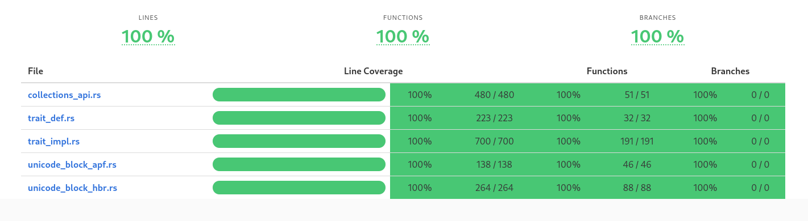

**Hebrew_Unicode_Script**


[](https://github.com/Roestdev/hebrew_unicode_script/actions/workflows/build_and_test.yml)
[](https://github.com/Roestdev/hebrew_unicode_script/actions/workflows/rust-clippy.yml)

**Table of contents**<a name="toc"></a>
<!-- toc -->
- [Project Status](#project-status)
- [Description ](#description-)
- [Examples ](#examples-)
  - [Using the function API](#using-the-function-api)
  - [Using the trait API](#using-the-trait-api)
- [Characteristics](#characteristics)
- [Install ](#install-)
- [Safety ](#safety-)
- [Panics ](#panics-)
- [Errors](#errors)
- [Code Coverage](#code-coverage)
- [Notes](#notes)
  - [Points](#points)
  - [Letters](#letters)
- [References](#references)
  - [Unicode Script 'Hebrew'](#unicode-script-hebrew)
  - [Unicode Block 'Hebrew'](#unicode-block-hebrew)
  - [Unicode Block 'Alphabetic Presentation Forms' (APF)](#unicode-block-alphabetic-presentation-forms-apf)
  - [Unicode problems for Hebrew](#unicode-problems-for-hebrew)
- [License](#license)
  - [Contribution](#contribution)
- [Questions, requests, bugs](#questions-requests-bugs)

<!-- tocstop -->

## Project Status 

**This project is currently in maintenance mode.**

`Current Version:` The latest stable release is version 2.0.0. This version includes all core functionalities for identifying and validating Unicode characters associated with the Hebrew script and its relevant Unicode code blocks.

`Stability:` The crate has been thoroughly tested and is considered stable for production use. Users can rely on its existing features without concern for significant changes or new functionalities being introduced.

`Updates:` While the project is not actively seeking new features or major enhancements, critical bug fixes and security updates will be addressed as needed. Users are encouraged to report any issues they encounter.

## Description <a name="description"></a>

This crate (`hebrew_unicode_script`) is a low-level library written in Rust and designed to facilitate the identification and validation of Unicode characters (Unicode code points) related to the **Hebrew** script and associated Unicode code blocks.

Both a check on individual characters and membership of collections are possible. Examples of collections are vowels, Yiddish characters, punctations etc.. 

More information can be found in the file [ARCHITECTURE](ARCHITECTURE.md).

This library provides *two* types of interfaces:

 1. **functions**

 2. **trait** (the same functions but behind a trait).

Each function in this library returns a boolean value, making it easy to integrate these controls into existing or new applications.

For an overview of released versions see [releases](https://github.com/Roestdev/hebrew_unicode_script/releases).


## Examples <a name="examples"></a>

### Using the function API

Basic usage:


```rust
use hebrew_unicode_script::is_hbr_consonant_mem;
use hebrew_unicode_script::is_hbr_consonant_normal;
use hebrew_unicode_script::is_hbr_consonant;
use hebrew_unicode_script::is_script_hbr_consonant;

assert!(is_hbr_consonant_mem('מ'));
assert!(is_hbr_consonant_normal('מ'));
assert!(is_hbr_consonant('מ'));
assert!(is_script_hbr_consonant('מ'));
```

```rust
use hebrew_unicode_script::is_hbr_block;

if is_hbr_block('מ') {
	println!("The character you entered is part of the 'unicode code block Hebrew'");
}
```

```rust
use hebrew_unicode_script::is_hbr_block;

if is_hbr_block('מ') {
	println!("The character you entered is part of the 'unicode code block Hebrew'");
}
```

```rust
use hebrew_unicode_script::{is_hbr_consonant_final, is_hbr_consonant};

let test_str = "ךםןףץ";
for c in test_str.chars() {
    assert!(is_hbr_consonant_final(c));
    assert!(is_hbr_consonant(c));
}
```

A more complex example:
```rust
use hebrew_unicode_script::{is_hbr_accent,is_hbr_mark, is_hbr_point, is_hbr_punctuation};
use hebrew_unicode_script::{is_hbr_consonant_final,is_hbr_yod_triangle,is_hbr_ligature_yiddish};

fn main() {
   // define a strings of characters
   let string_of_chars = "יָ֭דַעְתָּ שִׁבְתִּ֣י abcdefg וְקוּמִ֑י";
   // get a structures that indicates if a type is present or not (bool)
   let chartypes = get_character_types(string_of_chars);
   // print the results
   println!("The following letter types are found in: {}", string_of_chars);
   println!("{:?}",chartypes);
}

#[derive(Debug, Default)]
pub struct HebrewCharacterTypes {
    accent: bool,
    mark: bool,
    point: bool,
    punctuation: bool,
    letter: bool,
    letter_normal: bool,
    letter_final: bool,
    yod_triangle: bool,
    ligature_yiddish: bool,
    whitespace: bool,
    non_hebrew: bool,
}

impl HebrewCharacterTypes {
    fn new() -> Self {
        Default::default()
    }
}

pub fn get_character_types(s: &str) -> HebrewCharacterTypes {
    let mut found_character_types = HebrewCharacterTypes::new();
    for c in s.chars() {
        match c {
            c if is_hbr_accent(c) => found_character_types.accent = true,
            c if is_hbr_mark(c) => found_character_types.mark = true,
            c if is_hbr_point(c) => found_character_types.point = true,
            c if is_hbr_punctuation(c) => found_character_types.punctuation = true,
            c if is_hbr_consonant_final(c) => found_character_types.letter_final = true,
            c if is_hbr_yod_triangle(c) => found_character_types.yod_triangle = true,
            c if is_hbr_ligature_yiddish(c) => found_character_types.ligature_yiddish = true,
            c if c.is_whitespace() => found_character_types.whitespace = true,
            _ => found_character_types.non_hebrew = true,
        }
    }
    found_character_types.letter =
        found_character_types.letter_normal | found_character_types.letter_final;
    found_character_types
}
```

*Output result:*
   
``` txt
The following character types were found:
HebrewCharacterTypes {
    accent: true,
    mark: false,
    point: true,
    punctuation: false,
    letter: true,
    letter_normal: true,
    letter_final: false,
    yod_triangle: false,
    ligature_yiddish: false,
    whitespace: true,
    non_hebrew: true,
}
```

### Using the trait API

```
use hebrew_unicode_script::HebrewUnicodeScript;

assert!( 'מ'.is_script_hbr() );
assert!( !'מ'.is_script_hbr_point() );
assert!( 'ױ'.is_script_hbr_ligature_yiddisch() );
assert!( 'מ'.is_hbr_block() );
assert!( !'מ'.is_hbr_point() );
```

See the crate modules for more examples.

## Characteristics

This crate (`hebrew_unicode_script`) uses the `#![no_std]` attribute.

It does not depend on any standard library, nor a system allocator.


## Install <a name="install"></a>

For installation see the [hebrew_unicode_script](https://crates.io/crates/hebrew_unicode_script) page at crates.io.


## Safety <a name="safety"></a>

All functions are written in safe Rust.

## Panics <a name="panics"></a>

Not that I am aware of.

## Errors<a name="errors"></a>

All (trait)functions return either true *or* false.

## Code Coverage<a name="codecoverage"></a>

Current code coverage is *100%*



To generate the code coverage, I used grconv ([see here how to use it](https://github.com/mozilla/grcov?tab=readme-ov-file#usage)).

## Notes

### Points

- Hebrew **points** can be subdivided in:
  - Vowels (code points: *U+05B4 .. U+05BB and U+05C7*)
  - Semi-Vowels (code points: *U+05B0 .. U+05B3*)  
  - Reading Signs (code points: *U+05BC, U+05BD, U+05BF, U+05C1, U+05C2 and U+FB1E*)

### Letters

- Hebrew **letters** (consonants) can be subdivided in:
  - Normal consonants (code points: *U+05D0 .. U+05D9, U+05DB, U+05DC, U+05DE, U+05E0 .. U+05E2, U+05E4, U+05E6 .. U+05EA*)
  - Final consonants (code points: *U+05DA, U+05DD, U+05DF, U+05E3 and U+05E5*)  
  - Wide consonants (code points: *U+FB21 .. U+FB28*)
  - Alternative consonants (code points: *U+FB20, U+FB29*)

## References<a name="references"></a>

### Unicode Script 'Hebrew'

- [Unicode script for the Hebrew language](https://www.charactercodes.net/script/hebr)
- [Unicode15.0.0/chapter 9.1](https://www.unicode.org/versions/Unicode15.0.0/ch09.pdf) 

### Unicode Block 'Hebrew'

- See <https://www.unicode.org/charts/PDF/U0590.pdf>
  - **Note:** only the following code-point range is applicable:
    *U+0590 .. U+05FF*
  
- See also: <https://graphemica.com/blocks/hebrew/> 

### Unicode Block 'Alphabetic Presentation Forms' (APF)
 - See <https://www.unicode.org/charts/PDF/UFB00.pdf> 
   - **Note:** only the following code-point range is applicable: *U+FB1D .. U+FB4F*
- See also: <https://graphemica.com/blocks/alphabetic-presentation-forms>  

### Unicode problems for Hebrew

There are some issues with Unicode and Hebrew. These are described on the following web page: [Unicode Problems](https://mechon-mamre.org/c/hr/unicode.htm)  

<br>

To learn more about Unicode see: [Unicode main site](https://www.unicode.org/), [Unicode Scripts](https://www.unicode.org/standard/supported.html) and [Unicode Blocks](https://www.unicode.org/Public/UCD/latest/ucd/Blocks.txt)

See [Hebrew Cantillation Marks And Their Encoding](https://mechon-mamre.org/c/hr/index.htm) for more specifics on this matter.

## License

The `hebrew_unicode_script` library is distributed under either of

 * Apache License, Version 2.0
   ([LICENSE-APACHE](LICENSE-APACHE) or
   <http://www.apache.org/licenses/LICENSE-2.0>)
 * MIT license
   ([LICENSE-MIT](LICENSE-MIT) or
   <http://opensource.org/licenses/MIT>)

at your option.

### Contribution<a name="contribution"></a>

Unless you explicitly state otherwise, any contribution intentionally submitted
for inclusion in this crate by you, as defined in the Apache-2.0 license, shall
be dual licensed as above, without any additional terms or conditions.


## Questions, requests, bugs

I invite you to:

- Ask questions
- Make requests for new features or improvements
- Report bugs or suggest enhancements

Any input is welcome. To do this, you can submit a request [here](https://github.com/Roestdev/hebrew_unicode_script/issues).

