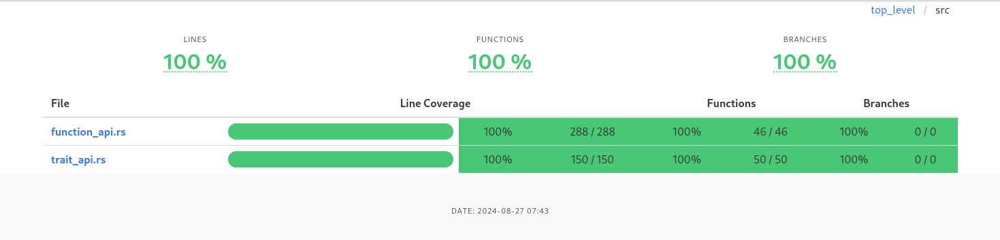

# Hebrew_Unicode_Script
## Table of contents <a name="toc"></a>
- [Hebrew\_Unicode\_Script](#hebrew_unicode_script)
  - [Table of contents ](#table-of-contents-)
  - [Description ](#description-)
    - [Function overview](#function-overview)
      - [Unicode script 'Hebrew' (top level):](#unicode-script-hebrew-top-level)
      - [Unicode block: 'Hebrew'](#unicode-block-hebrew)
      - [Unicode block: 'Alphabetic Presentation Form'](#unicode-block-alphabetic-presentation-form)
    - [Notes](#notes)
  - [Install ](#install-)
  - [Examples ](#examples-)
    - [Using the function API](#using-the-function-api)
    - [Using the trait API](#using-the-trait-api)
  - [References ](#references-)
    - [Unicode Script](#unicode-script)
    - [Unicode Block Names](#unicode-block-names)
    - [Unicode Problems for Hebrew](#unicode-problems-for-hebrew)
  - [Safety ](#safety-)
  - [Panics ](#panics-)
  - [Errors ](#errors-)
  - [Code Coverage ](#code-coverage-)
  - [License ](#license-)
  - [Contribution ](#contribution-)


## Description <a name="description"></a>

This crate (*hebrew_unicode_script*) is a low level library written in Rust and designed to facilitate the identification and validation of Unicode characters related to the Hebrew script and its associated unicode code blocks.   

This library provides *two* types of interface:
 1. **functions**
 2. **trait** (the same functions behind one trait)

The given set of functions (either direct of via a trait) allow developers to easily determine whether a particular character belongs to the *Hebrew unicode script*, falls within the *Hebrew unicode code block* or matches the *Alphabetic Presentation Form* unicode code block.   

For both of the applicable *unicode code blocks* there are some additional functions, allowing an even more refined check for the *character type* within each code block. Examples include vowels, accents, marks, etc.  

Each function in this library returns a boolean value, making it easy to integrate these checks into existing or new applications.

For an overview of released versions see [releases](https://github.com/Roestdev/hebrew_unicode_script/releases).

### Function overview

#### Unicode script 'Hebrew' (top level):

``` sh
  - is_script_hbr(c: char) -> bool
  - is_script_hbr_point(c: char) -> bool
  - is_script_hbr_consonant(c: char) -> bool
  - is_script_hbr_ligature_yiddisch(c: char) -> bool
```

#### Unicode block: 'Hebrew' 

2nd level:
``` sh
  - is_hbr_accent(c: char) -> bool
  - is_hbr_mark(c: char) -> bool
  - is_hbr_point(c: char) -> bool
  - is_hbr_punctuation(c: char) -> bool
  - is_hbr_consonant(c: char) -> bool
  - is_hbr_yod_triangle(c: char) -> bool
  - is_hbr_ligature_yiddish(c: char) -> bool
```

3rd level:
``` sh
    - is_hbr_point_vowel(c) -> bool
    - is_hbr_point_semi_vowel(c) -> bool
    - is_hbr_point_reading_sign(c) -> bool
    - is_hbr_consonant_normal(c: char) -> bool
    - is_hbr_consonant_final(c: char) -> bool
```

#### Unicode block: 'Alphabetic Presentation Form'

2nd level:
``` sh
  - is_apf_block(c: char) -> bool
  - is_apf_point_reading_sign(c: char) -> bool
  - is_apf_consonant(c: char) -> bool
  - is_apf_ligature_yiddisch(c: char) -> bool
  - is_apf_ligature(c: char) -> bool
```

3rd level:
``` sh
    - is_apf_consonant_alternative(c: char) -> bool
    - is_apf_consonant_wide(c: char) -> bool
    - is_apf_consonant_with_vowel(c: char) -> bool
```

### Notes

- Hebrew **points** can be subdivided in:
  - Vowels (code points: *U+05B4 .. U+05BB, U+05C7*)
  - Semi-Vowels (code points: *U+05B0 .. U+05B3*)  
  - Reading Signs (code points: *U+05BC .. U+05BD + U+05BF + U+05C1 .. U+05C2*) [^judeo-spanish]
  [^judeo-spanish]: For me it not clear yet if the 'HEBREW POINT JUDEO-SPANISH VARIKA' a reading sign or not.

- Hebrew **letters** can be subdivided in:
  - Normal consonants (code points: *U+05D0 .. U+05D9, U+05DB, U+05DC, U+05DE, U+05E0 .. U+05E2, U+05E4, U+05E6 .. U+05EA*)
  - Final consonants (code points: *U+05DA, U+05DD, U+05DF, U+05E3 and U+05E5*)  
  - Wide consonants (code points: *U+FB21 .. U+FB28*)
  - Consonants with vowel (code points: *U+FB2A .. U+FB36, U+FB38 .. U+FB3C, U+FB3E, U+FB40, U+FB41, U+FB43, U+FB44, U+FB46 .. U+FB4E*)
  - Alternative consonants (code points: *U+FB20, U+FB29*)

[^ TOC](#toc)

## Install <a name="install"></a>

Run the following Cargo command in your project directory:

`cargo add hebrew_unicode_script`

**OR** add the following line to your Cargo.toml under **dependencies**

`hebrew_unicode_script = "0.4.0`

See crates.io for the latest version!

[^ TOC](#toc)

## Examples <a name="examples"></a>

### Using the function API

Basic usage:

```rust
use hebrew_unicode_script::is_hbr_block;

if is_hbr_block('מ') {
	println!("The character you entered is part of the 'unicode code block Hebrew'");
}
```

```rust
use hebrew_unicode_script::{is_hbr_consonant_final, is_hbr_consonant};

let test_str = "ךםןףץ";
for c in test_str.chars() {
    assert!(is_hbr_consonant_final(c));
    assert!(is_hbr_consonant(c));
}
```

A more complex example:
```rust
use hebrew_unicode_script::{is_hbr_accent,is_hbr_mark, is_hbr_point, is_hbr_punctuation};
use hebrew_unicode_script::{is_hbr_consonant_final,is_hbr_yod_triangle,is_hbr_ligature_yiddish};

fn main() {
   // define a strings of characters
   let string_of_chars = "יָ֭דַעְתָּ שִׁבְתִּ֣י abcdefg וְקוּמִ֑י";
   // get a structures that indicates if a type is present or not (bool)
   let chartypes = get_character_types(string_of_chars);
   // print the results
   println!("The following letter types are found in: {}", string_of_chars);
   println!("{:?}",chartypes);
}

#[derive(Debug, Default)]
pub struct HebrewCharacterTypes {
    accent: bool,
    mark: bool,
    point: bool,
    punctuation: bool,
    letter: bool,
    letter_normal: bool,
    letter_final: bool,
    yod_triangle: bool,
    ligature_yiddish: bool,
    whitespace: bool,
    non_hebrew: bool,
}

impl HebrewCharacterTypes {
    fn new() -> Self {
        Default::default()
    }
}

pub fn get_character_types(s: &str) -> HebrewCharacterTypes {
    let mut found_character_types = HebrewCharacterTypes::new();
    for c in s.chars() {
        match c {
            c if is_hbr_accent(c) => found_character_types.accent = true,
            c if is_hbr_mark(c) => found_character_types.mark = true,
            c if is_hbr_point(c) => found_character_types.point = true,
            c if is_hbr_punctuation(c) => found_character_types.punctuation = true,
            c if is_hbr_consonant_final(c) => found_character_types.letter_final = true,
            c if is_hbr_yod_triangle(c) => found_character_types.yod_triangle = true,
            c if is_hbr_ligature_yiddish(c) => found_character_types.ligature_yiddish = true,
            c if c.is_whitespace() => found_character_types.whitespace = true,
            _ => found_character_types.non_hebrew = true,
        }
    }
    found_character_types.letter =
        found_character_types.letter_normal | found_character_types.letter_final;
    found_character_types
}
```

*Output result:*
   
``` txt
The following character types were found:
HebrewCharacterTypes {
    accent: true,
    mark: false,
    point: true,
    punctuation: false,
    letter: true,
    letter_normal: true,
    letter_final: false,
    yod_triangle: false,
    ligature_yiddish: false,
    whitespace: true,
    non_hebrew: true,
}
```

### Using the trait API

```
use hebrew_unicode_script::HebrewUnicodeScript;

assert!( 'מ'.is_script_hbr() );
assert!( !'מ'.is_script_hbr_point() );
assert!( 'מ'.is_script_hbr_consonant() );
assert!( 'ױ'.is_script_hbr_ligature_yiddisch() );
assert!( 'מ'.is_hbr_block() );
assert!( !'מ'.is_hbr_accent() );
assert!( !'מ'.is_hbr_mark() );
assert!( !'מ'.is_hbr_point() );
assert!( !'מ'.is_hbr_point_vowel() );
assert!( !'מ'.is_hbr_point_semi_vowel() );
assert!( '\u{05BF}'.is_hbr_point_reading_sign() );
assert!( '\u{05BE}'.is_hbr_punctuation() );
assert!( 'ץ'.is_hbr_consonant() );
assert!( !'ץ'.is_hbr_consonant_normal() );
assert!( 'ץ'.is_hbr_consonant_final() );
assert!( '\u{05EF}'.is_hbr_yod_triangle() );
assert!( !'מ'.is_hbr_ligature_yiddish() );
assert!( !'מ'.is_apf_block() );
assert!( !'מ'.is_apf_point_reading_sign() );
assert!( !'מ'.is_apf_consonant() );
assert!( !'מ'.is_apf_consonant_alternative() );
assert!( !'מ'.is_apf_consonant_wide() );
assert!( !'מ'.is_apf_consonant_with_vowel() );
assert!( !'מ'.is_apf_ligature_yiddisch() );
assert!( !'מ'.is_apf_ligature() );
```

See the crate modules for more examples.

[^ TOC](#toc)

## References <a name="references"></a>

### Unicode Script  

- [Unicode script for the Hebrew language](https://www.charactercodes.net/script/hebr)

### Unicode Block Names

1. *Hebrew*
    - See <https://www.unicode.org/charts/PDF/U0590.pdf>
      - **Note:** only the following code-point range is applicable: *U+0590 .. U+05FF*
      - See also: <https://graphemica.com/blocks/hebrew/>  
2. *Alphabetic Presentation Form*
    - See <https://www.unicode.org/charts/PDF/UFB00.pdf> 
      - **Note:** only the following code-point range is applicable: *U+FB1D .. U+FB4F*
      - See also: <https://graphemica.com/blocks/alphabetic-presentation-forms>  

Learn more about [Unicode](https://www.unicode.org/), [Unicode scripts](https://www.unicode.org/standard/supported.html) and [Unicode code point blocks](https://www.unicode.org/Public/UCD/latest/ucd/Blocks.txt)

### Unicode Problems for Hebrew

There are some issues with unicode and Hebrew. These are described on the following web page: [Unicode Problems](https://mechon-mamre.org/c/hr/unicode.htm)  

[^ TOC](#toc)

## Safety <a name="safety"></a>

All functions are written in safe Rust.


[^ TOC](#toc)

## Panics <a name="panics"></a>

Not that I am aware of.

[^ TOC](#toc)

## Errors <a name="errors"></a>

All (trait)functions return either true *or* false.

[^ TOC](#toc)

## Code Coverage <a name="codecoverage"></a>

Current code coverage is *100%* [^code coverage]
[^code coverage]: The code coverage figures shown in crates.io are (very) different!




I used [code coverage, running locally](https://blog.rng0.io/how-to-do-code-coverage-in-rust/#running-locally)

Actions:
1. Install the extension [Coverage Gutters](https://github.com/ryanluker/vscode-coverage-gutters)
2. Execute: `cargo clean && mkdir -p target/coverage/html`
3. Execute: `CARGO_INCREMENTAL=0 RUSTFLAGS='-Cinstrument-coverage' LLVM_PROFILE_FILE='cargo-test-%p-%m.profraw' cargo test`
   - result -> (new file) cargo-test-67187-8558864636421498001_0.profraw (on my system)

Option 1: Using Coverage Gutters

1. Execute: `grcov . --binary-path ./target/debug/deps/ -s . -t lcov --branch --ignore-not-existing --ignore '../*' --ignore "/*" -o target/coverage/tests.lcov`
   - result -> (new file) tests.lcov
  
2. Click on the *Watch* button (added to VSCodium by the Ext)
   - result -> red/green indications will appear for each line of code
   
Option 2: Creating a webpage

1. Execute: `grcov . --binary-path ./target/debug/deps/ -s . -t html --branch --ignore-not-existing --ignore '../*' --ignore "/*" -o target/coverage/html`
    - result -> a new directory called *html*
2. Open the file *index.html* in the folder html in your brower and you get a full report.


[^ TOC](#toc)

## License <a name="license"></a>

Licensed under either of <a href="LICENSE-APACHE">Apache License, Version
2.0</a> or <a href="LICENSE-MIT">MIT license</a> at your option.


[^ TOC](#toc)

## Contribution <a name="contribution"></a>

Unless you explicitly state otherwise, any contribution intentionally submitted
for inclusion in this crate by you, as defined in the Apache-2.0 license, shall
be dual licensed as above, without any additional terms or conditions.

[^ TOC](#toc)